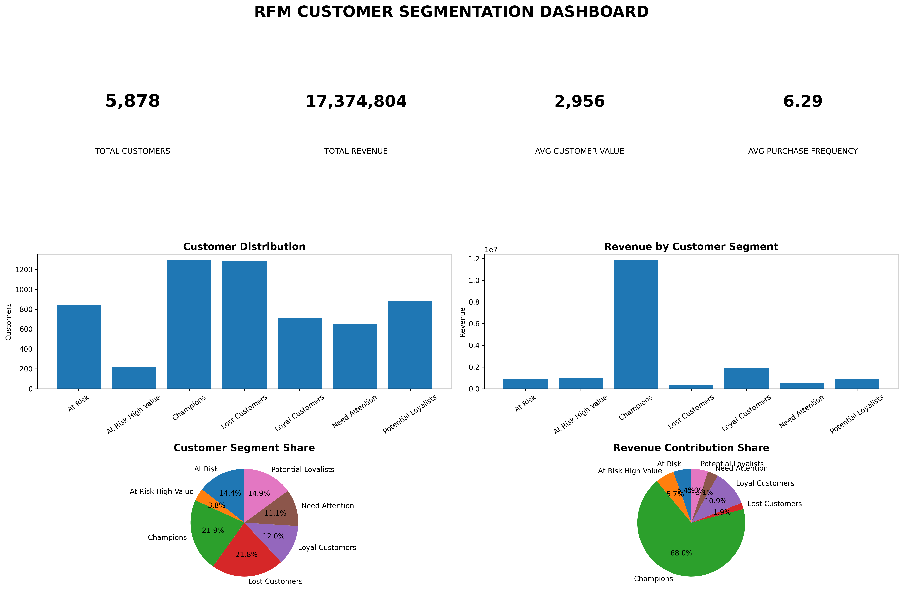

# 📊 RFM Customer Segmentation & Business Analytics

> A Python-based customer segmentation project using Recency, Frequency,
> and Monetary analysis to identify customer behavior, value, retention
> opportunities, and actionable marketing strategies.

# RFM Customer Segmentation & Business Analytics

## 📊 Dashboard

## Project Overview

This project uses RFM (Recency, Frequency, Monetary) analysis to segment
customers based on their purchasing behavior and identify actionable
business opportunities.

## Objectives

- Analyze customer purchasing behavior
- Calculate Recency, Frequency and Monetary metrics
- Develop customer segments
- Analyze revenue contribution
- Identify high-value and at-risk customers
- Develop segment-specific business recommendations

## Dataset

The analysis contains 5,878 customers.

## Methodology

Customer transaction data was transformed into customer-level RFM metrics:

- Recency — days since the customer's most recent purchase
- Frequency — number of purchases
- Monetary — total amount spent

Customers were then scored and classified into seven behavioral segments.

## Customer Segments

1. Champions
2. Loyal Customers
3. Potential Loyalists
4. At Risk High Value
5. At Risk
6. Need Attention
7. Lost Customers

## Dashboard

The project includes a dashboard showing:

- Total customers
- Total revenue
- Average customer value
- Average purchase frequency
- Customer distribution
- Revenue by segment
- Customer segment share
- Revenue contribution

## Key Insights

The analysis demonstrates that customer count and revenue contribution
are not necessarily proportional. High-value at-risk customers represent
an important retention opportunity, while lost customers can be targeted
through selective reactivation campaigns.

## Business Recommendations

Different customer segments should receive different marketing strategies,
including loyalty rewards, cross-selling, personalized retention campaigns,
re-engagement campaigns and selective reactivation.

## Tools & Technologies

- Python
- Pandas
- NumPy
- Matplotlib
- Google Colab

## Project Structure

rfm_project/
│
├── outputs/
│   ├── final_rfm_customer_segmentation.csv
│   ├── rfm_segment_summary.csv
│   └── rfm_business_recommendations.csv
│
├── visualizations/
│   ├── rfm_dashboard.png
│   ├── customer_distribution.png
│   ├── revenue_by_segment.png
│   └── revenue_contribution.png
│
├── requirements.txt
└── README.md
